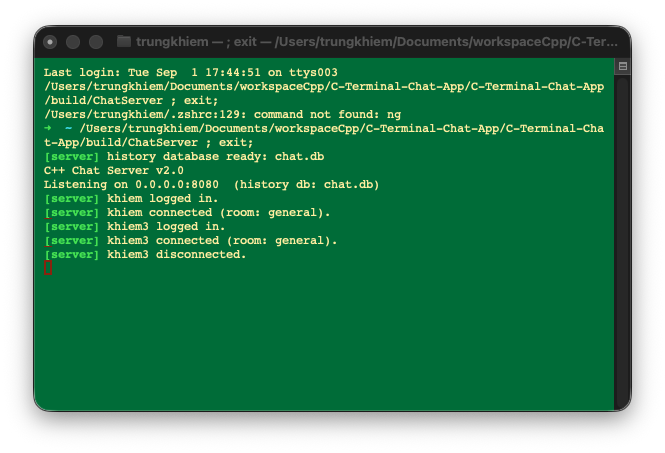
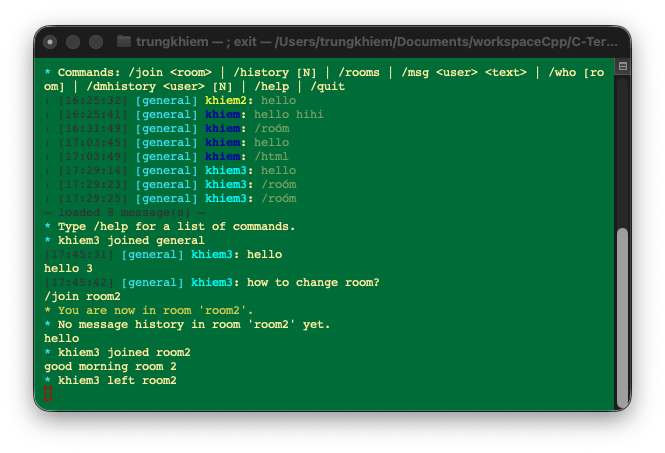
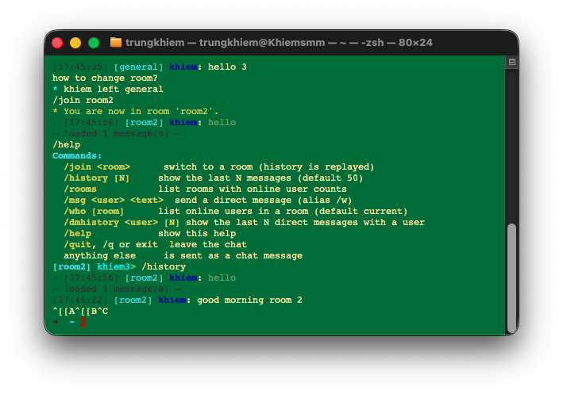

# C++ Chat Application

## Overview
This project is a simple client-server chat application implemented in C++. It demonstrates basic networking concepts, multi-threading, and modern C++ features.

### Features
- Multi-client support
- Real-time messaging
- Cross-platform compatibility (Windows, macOS, Linux)
- Simple command-line interface
- Length-prefixed TCP frames, so fragmented or combined TCP reads preserve message boundaries
- Registered user accounts (SHA-256 + per-user salt) — clients log in or create an account before chatting
- Chat rooms: clients start in a default `general` room and can switch with `/join <room>`; messages only broadcast to clients in the same room
- SQLite-backed message history, replayed automatically when a client connects or joins a room (`/history [N]`)
- Direct messages between users (`/msg <user> <text>`), persisted and replayable with `/dmhistory <user> [N]`
- Online presence per room (`/who [room]`)

## Prerequisites
- C++14 compatible compiler (GCC 5+, Clang 3.4+, MSVC 2015+)
- CMake 3.10 or higher
- Git (for cloning the repository)

## Building the Project

### Clone the Repository
```bash
git clone https://github.com/yourusername/cpp-chat-app.git
cd cpp-chat-app
```

### Build Instructions
```bash
mkdir build
cd build
cmake ..
cmake --build .
ctest --test-dir . --output-on-failure
```

## Running the Application

### Starting the Server
```bash
./ChatServer [port] [db_path]
```
- `port` (optional) — TCP port to listen on. Defaults to `8080`.
- `db_path` (optional) — path to the SQLite database file. Defaults to `chat.db`.

The server binds to all network interfaces (`INADDR_ANY`), so other machines on the same LAN can connect to it, not just `localhost`.

Examples:
```bash
./ChatServer                     # listen on 0.0.0.0:8080, db file chat.db
./ChatServer 9000                # listen on 0.0.0.0:9000, db file chat.db
./ChatServer 9000 rooms.db       # listen on 0.0.0.0:9000, custom db file
```

### Connecting with a Client
```bash
./ChatClient [host] [port]
```
- `host` (optional) — server address (IP or hostname). Defaults to `127.0.0.1`.
- `port` (optional) — server port. Defaults to `8080`.

Examples:
```bash
./ChatClient                     # connect to 127.0.0.1:8080
./ChatClient 192.168.1.10        # connect to a server on the LAN, default port
./ChatClient 192.168.1.10 9000   # connect to a LAN server on a custom port
```

Open many Clients terminal to send message to it and see the result.

## Screenshots

**Server console** — startup log and per-connection login/disconnect events:



**Client chat view** — colored messages and the `/help` command list:



**Switching rooms** — `/join <room>` moves the client to a new room with its own history:



### Client Commands
- `/join <room>` — switch to a room (history is replayed)
- `/history [N]` — show the last N messages in the current room (default 50)
- `/rooms` — list rooms with online user counts
- `/msg <user> <text>` (alias `/w`) — send a direct message
- `/dmhistory <user> [N]` — show the last N direct messages with a user
- `/who [room]` — list online users in a room (default current)
- `/help` — show the command list
- `/quit`, `/q`, or `exit` — leave the chat

## Project Structure
- `src/` - Source files
  - `chat_server.cpp` - Server implementation
  - `chat_client.cpp` - Client implementation
- `include/` - Header files
- `CMakeLists.txt` - CMake build configuration
- `README.md` - This file

## Technical Details
- Uses TCP sockets for communication
- Implements a multi-threaded server to handle multiple clients
- Uses C++14 features for improved code quality and performance

## Configuration
- Default server port: 8080 (override with `./ChatServer <port>`)
- Default database file: `chat.db` (override with `./ChatServer <port> <db_path>`)
- Default client target: `127.0.0.1:8080` (override with `./ChatClient <host> <port>`)

## Current Limitations
- There is no transport encryption (TLS), so credentials and messages are sent in plaintext over the socket.
- There is no rate limiting or brute-force protection on login attempts.
- No typing indicators — the client reads input line-by-line, not raw keystrokes.
- It is intended for trusted local networks while those capabilities are implemented.

## Planned Enhancements
- Add transport encryption (TLS) for connections.
- Add rate limiting / brute-force protection on login attempts.
- Further terminal/CLI UI polish (e.g. persistent online-count in the prompt).

## Contributing
Contributions to this project are welcome! Please follow these steps:
1. Fork the repository
2. Create a new branch for your feature
3. Commit your changes
4. Push to the branch
5. Create a new Pull Request
